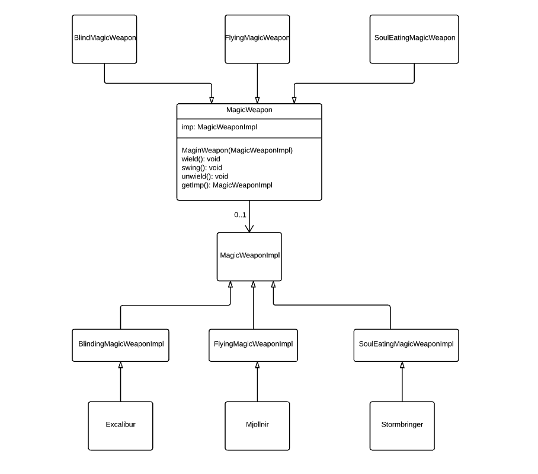

###定义：
把事物对象和其具体行为、具体特征分离开来，使它们可以各自独立的变化

###应用场景：
* 当你想要避免抽象和实现的固定绑定，如实现可能在运行时决定
* 抽象和实现都应该能被他们的子类拓展，这种情况下，桥接模式让你将不同的抽象和实现合并起来并且能够各自的拓展它们。
* 改变抽象的实现不会影响客户端，他们的代码不应该被重新编译
* 一个类的增值，这个类的层级表明需要将一个对象分成两部分。使用泛化嵌套来表示这类的层级结构。
* 想要分享多个对象的一个实现，但这个事实不必对客户端可见。String，多个对象能共享相同的字符表现

###真实案例:
####Java虚拟机
####Android ListView和BaseAdapter