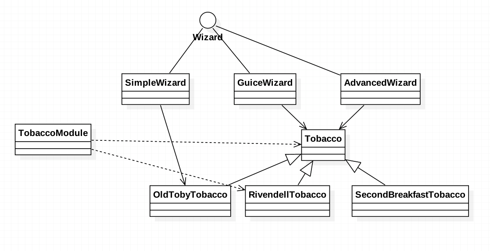

###定义：
Dependency Injection is a software design pattern in which one or more dependencies (or services) are injected, 
or passed by reference, into a dependent object (or client) and are made part of the client's state. 
The pattern separates the creation of a client's dependencies from its own behavior, which allows program designs to be loosely 
coupled and to follow the inversion of control and single responsibility principles.

###应用场景：
* when you need to remove knowledge of concrete implementation from object

* to enable unit testing of classes in isolation using mock objects or stubs

###真实案例: