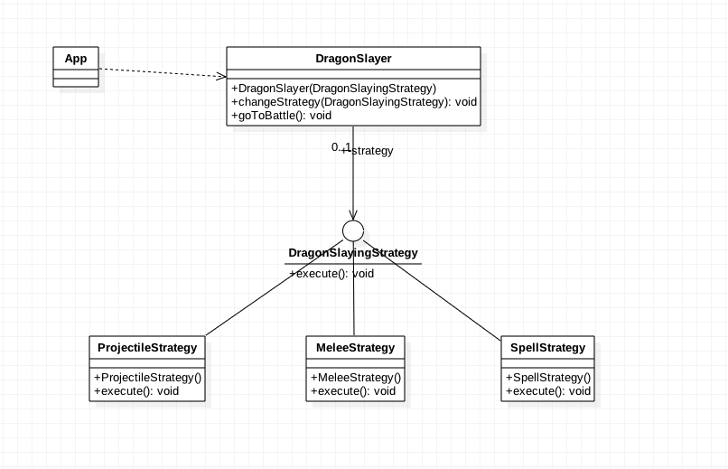

###定义：
定义了算法族，分别封装起来，让它们之间可以互相替换，让算法的变化独立于使用算法的客户 

###应用场景：
* many related classes differ only in their behavior. Strategies provide a way to configure a class either one of many behaviors

* you need different variants of an algorithm. for example, you might define algorithms reflecting different space/time trade-offs. 
  Strategies can be used when these variants are implemented as a class hierarchy of algorithms
  
* an algorithm uses data that clients shouldn't know about. Use the Strategy pattern to avoid exposing complex, algorithm-specific data structures
 
* a class defines many behaviors, and these appear as multiple conditional statements in its operations. 
  Instead of many conditionals, move related conditional branches into their own Strategy class 

###真实案例:
* Animator Interpolator